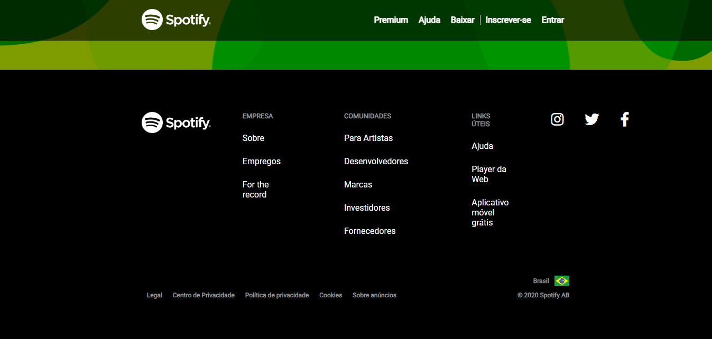
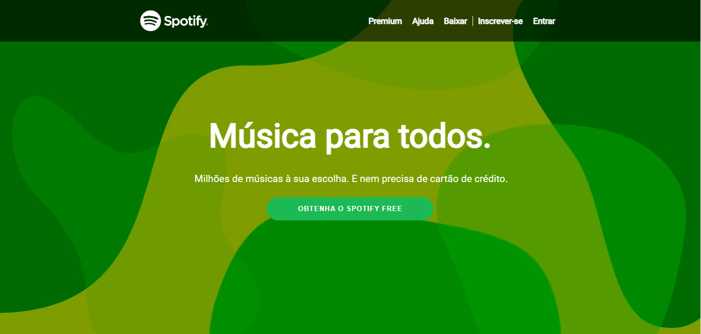

Clone da Tela Inicial do Spotify

Este projeto consiste em um clone da tela inicial do Spotify, desenvolvido utilizando apenas HTML e CSS. O objetivo é demonstrar a capacidade de reproduzir visualmente a página inicial do Spotify sem o uso de frameworks ou bibliotecas adicionais.

Tecnologias Utilizadas

* HTML5
* CSS3

Como Executar o Projeto

1. Clone o repositório para sua máquina local.
2. Abra o arquivo index.html em qualquer navegador web.

  Pré-visualização

